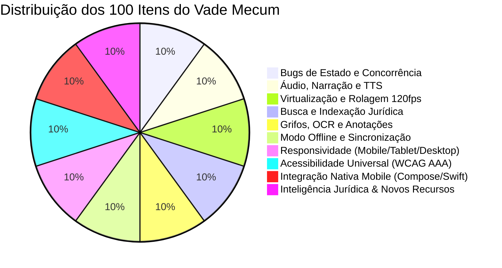

# 🏛️ Auditoria Técnica Profunda: 100 Itens do Vade Mecum (APP.PRIME)

> **Documento Estratégico de Engenharia, Qualidade de Software, Acessibilidade e Evolução de Produto**  
> **Escopo:** Ecossistema Vade Mecum (`src/pages/VadeMecum*`, `src/components/vademecum/*`, hooks, virtualização, persistência, pontes nativas Android/iOS).  
> **Padrões de Referência:** Android Adaptive Apps Guidelines, Material Design 3, Apple Human Interface Guidelines, WCAG 2.2 AAA, MDN Web APIs, Capacitor 8.

---

## 📊 Matriz Executiva de Diagnóstico (100 Itens)

---

## I. Bugs de Estado, Renderização e Concorrência no Leitor (`ArtigoBottomSheet`)

### 1. Race Condition na Troca Rápida de Artigos via Gesto/Navegação
- **Problema:** Quando o usuário avança rapidamente entre artigos (clicando em "Próximo" ou deslizando o dedo), requisições assíncronas do artigo anterior (`appEvents.viewArtigo`, fetch de anotações e IA) sobrescrevem os dados do novo artigo montado.
- **Impacto:** O modal exibe o número do artigo novo, mas o texto da explicação ou o botão de favorito refletem o artigo anterior.
- **Correção:** Utilizar `AbortController` ou token de requisição cancelável vinculado a `artigo.id` em todos os efeitos assíncronos.
- **Complexidade:** Média | **Prioridade:** Alta

### 2. Desalinhamento do Scroll Lock com Modais Aninhados
- **Problema:** Ao abrir um sub-modal (ex: `AnotacoesSheet` ou `PraticarModal`) de dentro do `ArtigoBottomSheet` e depois fechá-lo, o hook `useBodyScrollLock` libera o scroll do `<body>` do aplicativo prematuramente.
- **Impacto:** O fundo do aplicativo começa a rolar por trás do `ArtigoBottomSheet`, quebrando a rolagem do artigo.
- **Correção:** Implementar contador de pilha para o scroll lock (`scrollLockDepth++` / `scrollLockDepth--`) para liberar o body somente no fechamento do último modal.
- **Complexidade:** Baixa | **Prioridade:** Alta

### 3. Falha de Regex Não-Escapada em `highlightTermos`
- **Problema:** A função de realce léxico em `artigoTextUtils.tsx` injeta termos de pesquisa diretamente no `new RegExp(termo, 'gi')` sem escapar caracteres reservados como `(`, `[`, `*`, `+` ou `.`.
- **Impacto:** Digitar `art. 5º (inciso)` na busca causa `SyntaxError: Invalid regular expression` e fecha a aplicação com crash.
- **Correção:** Sanitizar entradas com função de escape regex: `termo.replace(/[.*+?^${}()|[\]\\]/g, '\\$&')`.
- **Complexidade:** Baixa | **Prioridade:** Crítica

### 4. Mojibake Residual em Emendas e Redações Revogadas
- **Problema:** Parágrafos históricos de leis antigas (especialmente Código Civil de 1916 ou CLT pré-reforma) contêm caracteres corrompidos (``, `ç`, `ã`) decorrentes de dupla decodificação ISO-8859-1 / UTF-8.
- **Impacto:** Degradação visual e perda de credibilidade editorial em citações legislativas formais.
- **Correção:** Reforçar o parser `fixMojibake` em `src/lib/mojibake.ts` cobrindo caracteres diacríticos compostos e entidades HTML legadas do Diário Oficial.
- **Complexidade:** Média | **Prioridade:** Média

### 5. Falta de Cancelamento de Requisição de IA ao Fechar Modal
- **Problema:** Se o usuário solicita a explicação "Me Explique" de um artigo e fecha o modal antes da resposta, a chamada do Edge Function continua rodando até o fim.
- **Impacto:** Consumo desnecessário de tokens do modelo no Supabase e de bateria/dados do usuário.
- **Correção:** Passar `signal: abortController.signal` para a chamada fetch do Edge Function e disparar `abort()` no unmount do modal.
- **Complexidade:** Baixa | **Prioridade:** Média

### 6. Memory Leak de Listeners de Teclado no Desktop
- **Problema:** No modo Desktop, o atalho `Esc` para fechar e as setas `←` / `→` para navegar entre artigos acumulam listeners se o componente re-renderizar frequentemente.
- **Impacto:** Queda progressiva de desempenho e chamadas de navegação duplicadas após horas de estudo contínuo.
- **Correção:** Centralizar o listener em um hook dedicado `useArtigoKeyNavigation` com limpeza estrita no cleanup de `useEffect`.
- **Complexidade:** Baixa | **Prioridade:** Alta

### 7. Re-execução Redundante de `useArtigoTextProcessing`
- **Problema:** O hook que processa parágrafos, alíneas, incisos e termos destacados recalcula todo o texto do artigo mesmo quando apenas o estado de áudio ou um comentário visual foi alterado.
- **Impacto:** Lag de 30-50ms na thread principal da UI ao pausar/despausar narração em artigos quilométricos (ex: art. 5º da CF).
- **Correção:** Isolar a tokenização de texto em `useMemo` dependente estritamente de `[artigo.texto, termosPesquisa]`.
- **Complexidade:** Média | **Prioridade:** Alta

### 8. Dessincronização de Grifos Táteis ao Alternar Abas
- **Problema:** Ao mudar da aba "Artigo" para "Exemplo Prático" e retornar, o canvas de grifo mágico perde a correspondência geométrica dos spans de texto.
- **Impacto:** Grifos amarelos e verdes aparecem deslocados em relação às palavras corretas.
- **Correção:** Forçar re-cálculo das coordenadas com `requestAnimationFrame` assim que a aba "Artigo" volta a ser ativa.
- **Complexidade:** Média | **Prioridade:** Alta

### 9. URL Incorreta do Planalto para Artigos com Sufixos Alfanuméricos
- **Problema:** O gerador de link externo do Planalto (`buildPlanaltoArticleUrl`) falha em artigos como "Art. 149-A", "Art. 310-B" ou "Artigo Único", direcionando para a âncora errada no site do governo.
- **Impacto:** Erro 404 de âncora externa ou posicionamento no topo do documento.
- **Correção:** Mapear sufixos com expressões regulares compatíveis com o padrão de IDs do Planalto (`art149a.htm` / `art310-b`).
- **Complexidade:** Baixa | **Prioridade:** Baixa

### 10. Colisão Visual entre Modal e Miniplayer Flutuante de Áudio
- **Problema:** O rodapé do `ArtigoBottomSheet` e o miniplayer flutuante (`useNarracaoFlutuante`) disputam a mesma coordenada vertical inferior (`bottom-0`).
- **Impacto:** O botão de narração fica sobreposto ao miniplayer, impossibilitando o clique em telas menores que 380px.
- **Correção:** Adicionar padding dinâmico condicional `pb-[calc(4rem+var(--miniplayer-height,0px))]` quando o player flutuante estiver ativo.
- **Complexidade:** Baixa | **Prioridade:** Alta

---

## II. Engenharia de Áudio, Narração e Sincronização TTS (`useArtigoNarracao`)

### 11. Vazamento de Áudio em Background sem Controle de Ciclo de Vida
- **Problema:** Ao navegar para fora do Vade Mecum enquanto um artigo está sendo narrado, o player nativo (`HTMLAudioElement`) continua reproduzindo sem pausa automática se a rota não interceptar o unmount.
- **Impacto:** Áudio tocando indesejadamente em outras seções do app e consumo silencioso de bateria.
- **Correção:** Adicionar listener global de rota com pause automático ou chaveamento explícito para o miniplayer flutuante.
- **Complexidade:** Baixa | **Prioridade:** Alta

### 12. Saturação Concorrente de Geração de Áudio (Double-Click Flooding)
- **Problema:** O usuário clica repetidas vezes no botão "Ouvir Artigo" enquanto a síntese está sendo processada, gerando múltiplas requisições simultâneas de geração de áudio no Supabase.
- **Impacto:** Custo desnecessário de geração de voz por IA e áudios reproduzindo em eco sobrepostos.
- **Correção:** Implementar trava com estado de loading `isGeneratingAudio: boolean` e desabilitar cliques no botão até o stream iniciar.
- **Complexidade:** Baixa | **Prioridade:** Alta

### 13. Ausência de Retry Exponencial em Áudios com Falha Transitória
- **Problema:** Em conexões 3G instáveis, se a requisição do chunk de áudio falhar uma vez, o player entra em estado de erro definitivo sem tentar novamente.
- **Impacto:** O usuário é obrigado a fechar o modal e reabrir para tentar ouvir novamente.
- **Correção:** Implementar política de 3 retentativas automáticas com jitter exponencial (1s, 2s, 4s) antes de declarar falha.
- **Complexidade:** Média | **Prioridade:** Média

### 14. Dessincronização do Indicador Circular em Velocidades 1.5x e 2.0x
- **Problema:** O cálculo do offset do anel de progresso circular (`RING_CIRCUMFERENCE`) utiliza intervalo fixo de 250ms que não acompanha proporcionalmente o playback rate acelerado.
- **Impacto:** O anel termina antes do áudio acabar ou fica atrasado em relação à voz acelerada.
- **Correção:** Atualizar o anel baseado no evento nativo `timeupdate` do elemento de áudio, computando `currentTime / duration`.
- **Complexidade:** Baixa | **Prioridade:** Média

### 15. Falta de Realce Visual Palavra por Palavra (Modo Karaokê)
- **Problema:** O Vade Mecum já recebe `word_timings` do motor de voz, mas apenas realça o bloco inteiro do parágrafo, não a palavra que está sendo falada no segundo exato.
- **Impacto:** O estudante perde o foco da leitura em artigos longos com redação densa.
- **Correção:** Conectar os `word_timings` aos spans de texto para aplicar classe CSS `bg-emerald-500/20 text-emerald-300 font-semibold` na palavra ativa em tempo real.
- **Complexidade:** Média | **Prioridade:** Alta (Grande ganho de UX)

### 16. Metadados Truncados na MediaSession API do Android/iOS
- **Problema:** Artigos com ementa ou número longo estouram os limites de caracteres do painel de controle de mídia na barra de notificações do Android e na tela de bloqueio do iOS.
- **Impacto:** O título do áudio aparece com corte feio (`...`) ou quebra o layout da lockscreen.
- **Correção:** Formatar o título da MediaSession estritamente no padrão: `"[Sigla] Art. [Nº] • [Nome Breve da Lei]"`.
- **Complexidade:** Baixa | **Prioridade:** Baixa

### 17. Desperdício de Memória com Conversão Base64 de Áudios WAV
- **Problema:** A rotina `saveGeneratedAudioToSupabase` decodifica strings Base64 gigantes na thread principal via `atob()` para gerar `Uint8Array`.
- **Impacto:** Picos de 50MB a 80MB de memória RAM durante a conversão, provocando pequenos congelamentos em celulares modestos.
- **Correção:** Utilizar streaming direto de `Blob` ou `ArrayBuffer` recebido diretamente da API sem passar por Base64 textual.
- **Complexidade:** Média | **Prioridade:** Alta

### 18. Falta de Cache Offline em IndexedDB para Narrações Frequentes
- **Problema:** Artigos muito acessados (como Art. 5º da CF e Art. 121 do CP) baixam o mesmo áudio repetidamente toda vez que o usuário dá play.
- **Impacto:** Consumo de franquia de dados móveis e dependência de internet para ouvir leis já escutadas.
- **Correção:** Armazenar os Blobs de áudio reproduzidos no store IndexedDB `vademecum_audio_cache` com política LRU de 50 áudios mais recentes.
- **Complexidade:** Média | **Prioridade:** Alta

### 19. Conflito entre Síntese Nativa (`speakNative`) e Áudio Gravado
- **Problema:** Quando um artigo possui áudio pré-gravado mas o usuário aperta o botão de voz nativa do aparelho simultaneamente, os dois mecanismos disparam juntos.
- **Impacto:** Duas vozes falando o mesmo artigo ao mesmo tempo com timbres e velocidades diferentes.
- **Correção:** Mutex compartilhado: invocar `stopNativeSpeech()` obrigatoriamente antes de dar play no áudio do Supabase e vice-versa.
- **Complexidade:** Baixa | **Prioridade:** Alta

### 20. Ausência de Fade-Out Suave ao Pausar ou Fechar o Player
- **Problema:** Pausar a narração corta o som de forma abrupta, gerando um "estalo" (clipping digital) nos fones de ouvido.
- **Impacto:** Experiência auditiva desconfortável para quem estuda com fones por muitas horas.
- **Correção:** Aplicar rampa de atenuação de volume via Web Audio API de 0.15 segundos (`gainNode.linearRampToValueAtTime(0, ctx.currentTime + 0.15)`) antes do pause.
- **Complexidade:** Média | **Prioridade:** Média

---

## III. Virtualização, Rolagem e Performance da Lista de Artigos (`LeiArtigosVirtualList`)

### 21. Altura Estimada Estática (`estimateSize: 116`) Causando Saltos Visuais
- **Problema:** O virtualizador assume que todo artigo tem 116px de altura. Artigos com 20 incisos medem mais de 800px, enquanto artigos revogados medem 48px.
- **Impacto:** A barra de rolagem dá saltos bruscos (jitter) durante o scroll rápido, desorientando a leitura.
- **Correção:** Utilizar `estimateSize` dinâmico baseado na contagem de caracteres do texto do artigo: `Math.max(64, Math.round(artigo.texto.length / 3))`.
- **Complexidade:** Média | **Prioridade:** Alta

### 22. Função de Highlight Mockada em `LeiArtigosVirtualList`
- **Problema:** A linha 42 do arquivo contém `const highlightText = (text: string) => text; // Implement real highlighting if needed`.
- **Impacto:** Quando o usuário digita na busca dentro da lei, os cards não destacam visualmente a palavra encontrada na lista, forçando o usuário a procurar o termo com os olhos.
- **Correção:** Substituir o mock por componente que embrulha o texto com `<mark className="bg-amber-400/30 text-amber-200">`.
- **Complexidade:** Baixa | **Prioridade:** Alta (Bug real no código)

### 23. Ausência de Dynamic Measurement Cache no Virtualizador
- **Problema:** Itens já medidos pelo `ResizeObserver` perdem suas medidas reais ao sofrer unmount quando o usuário rola muitas páginas à frente.
- **Impacto:** Recálculos desnecessários de layout e repaint a cada rolagem de volta para o topo.
- **Correção:** Habilitar cache de medições persistente por ID do artigo vinculado ao `@tanstack/react-virtual`.
- **Complexidade:** Média | **Prioridade:** Média

### 24. Layout Thrashing por Leitura Repetida de `getBoundingClientRect`
- **Problema:** O hook `useLayoutEffect` lê `getBoundingClientRect().top` forçando um reflow síncrono da página a cada mudança de tamanho ou redimensionamento.
- **Impacto:** Queda da taxa de quadros de 120fps para menos de 45fps em rolagem rápida no mobile.
- **Correção:** Ler o offset do contêiner uma única vez no mount e recalcular apenas sob evento de redimensionamento de janela debounced.
- **Complexidade:** Baixa | **Prioridade:** Alta

### 25. Salto de Scroll ao Alternar Entre Leis Discrepantes
- **Problema:** O cache de offset da lista (`virtualOffsetCache`) armazena a posição, mas se o usuário abre uma lei com 30 artigos após estar no artigo 1500 do Código Civil, a página tenta rolar além do final da lei.
- **Impacto:** Tela cinza vazia sem artigos renderizados até que o usuário role manualmente para cima.
- **Correção:** Validar se o offset recuperado é menor que o `totalSize` da lei atual antes de restaurar: `Math.min(savedOffset, totalSize - windowHeight)`.
- **Complexidade:** Baixa | **Prioridade:** Alta

### 26. Ausência de `contain: content` nos Contêineres de Artigos Virtuais
- **Problema:** Cada card de artigo virtualizado afeta o cálculo de geometria global do DOM pai.
- **Impacto:** O navegador recalcula o layout da página inteira a cada novo card que entra na viewport.
- **Correção:** Aplicar `contain: layout style paint; will-change: transform` no estilo do wrapper de cada artigo virtualizado.
- **Complexidade:** Baixa | **Prioridade:** Alta

### 27. Recálculo Não-Debounced de `visibleArtigos` Durante Busca Interna
- **Problema:** Ao pesquisar dentro de uma lei no cabeçalho, a lista filtra todos os artigos a cada tecla digitada sem intervalo de debounce.
- **Impacto:** Digitação travada e engasgos visuais no teclado virtual do celular em leis grandes como CC e CPC.
- **Correção:** Envelopar o filtro de busca da lista em `useDeferredValue` (React 18) ou `useDebounce(searchQuery, 150)`.
- **Complexidade:** Baixa | **Prioridade:** Alta

### 28. Perda de Referência do Scroll na Mudança de Orientação do Tablet
- **Problema:** Ao girar o iPad ou tablet Android entre Portrait e Landscape, as alturas dos cards mudam (mais linhas no portrait, menos no landscape) e o artigo em leitura desaparece da tela.
- **Impacto:** O estudante perde a referência de onde estava lendo e precisa procurar o artigo novamente.
- **Correção:** Rastrear o `index` do artigo visível no centro da tela e forçar `artigosVirtualizer.scrollToIndex(centerIndex, { align: 'center' })` após o evento de `orientationchange`.
- **Complexidade:** Média | **Prioridade:** Alta

### 29. Overscan Fixo de 20 Itens Penalizando Aparelhos Modestos
- **Problema:** O virtualizador mantém 20 artigos acima e 20 abaixo da tela renderizados na memória DOM em qualquer aparelho.
- **Impacto:** Celulares com pouca memória (2GB/3GB de RAM) sofrem throttling e descarte forçado de aba pelo sistema operacional.
- **Correção:** Calibrar o overscan dinamicamente: 6 itens no mobile modesto, 12 no mobile moderno e 20 no desktop widescreen.
- **Complexidade:** Baixa | **Prioridade:** Média

### 30. Falta de Restauração do Artigo em Leitura ao Reabrir a Lei
- **Problema:** Se o usuário fechar a lei para consultar outra ou sair do app, ao retornar ele sempre volta ao Art. 1º.
- **Impacto:** Perda de tempo em leis extensas com centenas de páginas.
- **Correção:** Salvar no `localStorage` a chave `last_article_${tabelaNome}` e oferecer botão flutuante discreto: "Continuar do Art. 186".
- **Complexidade:** Baixa | **Prioridade:** Alta (Melhoria direta de UX)

---

## IV. Motor de Busca Jurídica e Indexação (`BuscaLeisOverlay` & `BuscadorLeis`)

### 31. Falha em Numerações Complexas de Artigos Jurídicos
- **Problema:** A regex atual (`\d+[-a-zA-Z]*`) extrai apenas dígitos simples. Consultas como "artigo 5º, inciso LV" ou "art. 100-A" não encontram o inciso ou perdem a letra complementar.
- **Impacto:** Usuário não localiza garantias fundamentais populares se digitar a pontuação formal.
- **Correção:** Regex aprimorada com normalização de números ordinais: `/(?:art(?:igo)?\.?\s*)?(\d+)(?:[º°ªa-zA-Z\-_]*)(?:\s*(?:inc(?:iso)?\.?\s*)?([ivxlcdm]+|\d+))?/i`.
- **Complexidade:** Média | **Prioridade:** Alta

### 32. Ausência de Dicionário de Sinônimos Jurídicos na Busca
- **Problema:** O estudante pesquisa por "legítima defesa" e a busca literal falha se a lei usar a redação técnica "excludente de ilicitude" ou se pesquisar "demissão" em vez de "rescisão do contrato de trabalho".
- **Impacto:** Sensação de que o Vade Mecum "não possui" o conteúdo procurado.
- **Correção:** Implementar mapa léxico de equivalências jurídicas que expande termos populares para termos técnicos na query.
- **Complexidade:** Média | **Prioridade:** Alta

### 33. Bloqueio da Thread Principal com Filtro Síncrono de Múltiplos Catálogos
- **Problema:** A busca do overlay filtra simultaneamente os catálogos de Constituição, Códigos, Estatutos e Legislação Ordinária na mesma thread síncrona.
- **Impacto:** Travamento momentâneo de 100ms no cursor de texto do input.
- **Correção:** Delegar a busca textual pesada para um Web Worker (`legislacaoSearch.worker.ts`) ou particionar em chunks via `scheduler.yield()`.
- **Complexidade:** Alta | **Prioridade:** Média

### 34. Inexistência de Histórico de Pesquisas Recentes
- **Problema:** Toda vez que o overlay de busca abre, o usuário encontra apenas a lista estática de "Artigos em Alta", sem suas pesquisas anteriores.
- **Impacto:** Redigitação repetida dos mesmos artigos ao longo do dia de estudo.
- **Correção:** Adicionar seção "Pesquisas Recentes" com os últimos 8 termos buscados, salvos em `localStorage` com botão de remoção individual.
- **Complexidade:** Baixa | **Prioridade:** Alta

### 35. Ausência de Autocomplete Inteligente no Campo de Busca
- **Problema:** O campo de busca não oferece sugestões de preenchimento automático conforme o usuário digita as primeiras letras de uma lei ou código.
- **Impacto:** Mais toques necessários no teclado virtual móvel.
- **Correção:** Dropdown inline com autocompletar de títulos e siglas oficiais (ex: "cod pen" -> "Código Penal (CP)").
- **Complexidade:** Baixa | **Prioridade:** Média

### 36. Tecla Enter no Teclado Físico Não Abre o Primeiro Resultado
- **Problema:** Ao pesquisar no Desktop ou iPad com teclado externo e pressionar `Enter`, o formulário não executa ação alguma.
- **Impacto:** O usuário é forçado a tirar as mãos do teclado e usar o mouse/trackpad para clicar no resultado.
- **Correção:** Adicionar listener `onKeyDown` no input: se `key === 'Enter'` e houver ao menos 1 resultado filtrado, invocar `onSelectLei(primeiroItem)`.
- **Complexidade:** Baixa | **Prioridade:** Alta

### 37. Impossibilidade de Buscar Súmulas Vinculantes Diretamente pelo Número
- **Problema:** O buscador do Vade Mecum possui modo "Artigos" e "Leis", mas não possui busca direta de Súmulas Vinculantes pelo número (ex: "SV 13" ou "Súmula 331 TST").
- **Impacto:** O estudante precisa sair do Vade Mecum e navegar até outra tela do aplicativo para consultar a súmula.
- **Correção:** Adicionar rota de busca universal que reconhece o prefixo "SV" ou "Súmula" e exibe o card da súmula no próprio resultado.
- **Complexidade:** Média | **Prioridade:** Alta

### 38. Perda de Estado da Busca ao Minimizar o Aplicativo no Celular
- **Problema:** Se o usuário está com uma busca aberta no celular e alterna para o WhatsApp para copiar uma dúvida, ao retornar o overlay fecha e limpa o campo.
- **Impacto:** Frustração e perda da linha de raciocínio.
- **Correção:** Preservar o estado do overlay e a query ativa em `sessionStorage` durante o ciclo de vida da sessão.
- **Complexidade:** Baixa | **Prioridade:** Média

### 39. Falta de Realce em Amarelo nas Ementas dos Resultados Encontrados
- **Problema:** Os cards de leis encontrados exibem o texto da descrição mas não destacam em qual trecho o termo pesquisado foi encontrado.
- **Impacto:** Dificuldade visual para entender o porquê daquele resultado ter sido retornado.
- **Correção:** Envelopar as ocorrências do termo com `` na renderização das descrições.
- **Complexidade:** Baixa | **Prioridade:** Média

### 40. Ausência de Chips de Filtro Rápido por Ramo Jurídico
- **Problema:** Resultados de leis misturam normas de ramos completamente diferentes (ex: Penal com Tributário).
- **Impacto:** O estudante de Direito Penal precisa rolar por leis administrativas até encontrar o que procura.
- **Correção:** Inserir barra de chips horizontais abaixo do input: `[Todos] [Constitucional] [Penal] [Civil] [Trabalhista] [Tributário]`.
- **Complexidade:** Baixa | **Prioridade:** Alta

---

## V. Sistema de Grifos, Marcações e OCR (`useArtigoGrifoMagico`)

### 41. Colisão de Coordenadas de Grifos Sobrepostos no DOM
- **Problema:** Se o usuário faz um grifo manual amarelo em uma frase e depois ativa o "Grifo Mágico" da IA (que marca palavras-chave em verde), as tags `` aninhadas quebram a árvore do DOM.
- **Impacto:** Falhas visuais com trechos de texto duplicados ou grifos desaparecendo após recarregar a página.
- **Correção:** Algoritmo de fusão de intervalos (Interval Tree / Range Merging) que consolida marcações sobrepostas em uma única estrutura normalizada.
- **Complexidade:** Alta | **Prioridade:** Alta

### 42. Perda de Grifos Offline por Falta de Fila de Sincronização
- **Problema:** Se o usuário marca um artigo importante enquanto está offline ou com sinal fraco no metrô, a chamada de mutação do Supabase falha silenciosamente.
- **Impacto:** Ao reabrir o app com internet, o grifo feito anteriormente foi perdido.
- **Correção:** Salvar imediatamente o grifo no IndexedDB local (`vademecum_highlights_pending`) e disparar sincronização com o Supabase via `navigator.onLine` e Background Sync.
- **Complexidade:** Média | **Prioridade:** Crítica

### 43. Falta de Exportação de Grifos e Caderno de Erros para PDF/Anki
- **Problema:** O estudante acumula dezenas de artigos grifados ao longo de meses, mas não tem como exportar um resumo com apenas o que ele grifou.
- **Impacto:** Retenção do usuário prejudicada na fase de revisão final pré-prova.
- **Correção:** Botão "Exportar Meus Grifos": gera PDF limpo com os artigos selecionados ou arquivo `.apkg` para importar direto no Anki.
- **Complexidade:** Média | **Prioridade:** Alta (Funcionalidade muito solicitada)

### 44. Baixo Contraste de Cores de Grifo no Modo Escuro (Dark Mode)
- **Problema:** Cores tradicionais de marca-texto (amarelo fosforescente, verde limão) possuem luminância excessiva sobre o fundo preto `#09090b`.
- **Impacto:** Ofuscamento visual e desconforto ocular em sessões de estudo noturnas.
- **Correção:** Adotar paleta calibrada para dark mode: amarelo âmbar translúcido (`rgba(245, 158, 11, 0.25)`), esmeralda suave (`rgba(16, 185, 129, 0.25)`) e roxo elétrico suave.
- **Complexidade:** Baixa | **Prioridade:** Alta

### 45. Falhas de Quebra de Linha Dura no OCR de Livros Físicos (`GrifoFotoSheet`)
- **Problema:** Ao fotografar uma página de livro de papel para extrair grifos, o motor OCR mantém quebras de linha com hifenização ("responsa- bilidade").
- **Impacto:** A busca não encontra o artigo correspondente devido a palavras cortadas ao meio.
- **Correção:** Sanitizador regex pós-OCR que remove hífens de final de linha e unifica parágrafos contínuos antes da busca.
- **Complexidade:** Média | **Prioridade:** Média

### 46. Ausência de Feedback Tátil Háptico Diferenciado na Seleção
- **Problema:** O usuário seleciona um trecho para grifar mas não tem confirmação física de que o grifo foi registrado.
- **Impacto:** Dúvida sobre o sucesso da ação, gerando toques repetidos.
- **Correção:** Disparar `haptic.selection()` ao arrastar a seleção e `haptic.impact('medium')` no momento em que a cor de grifo é aplicada.
- **Complexidade:** Baixa | **Prioridade:** Média

### 47. Limite Oculto de Anotações por Artigo sem Aviso Visual
- **Problema:** O banco impõe limites no payload de anotações por artigo, mas a interface não avisa quantos caracteres restam.
- **Impacto:** Se o texto for muito longo, o botão salvar falha sem mensagem de erro clara.
- **Correção:** Contador visual de caracteres (`1.240 / 5.000 caracteres`) com alerta âmbar quando atingir 90% da capacidade.
- **Complexidade:** Baixa | **Prioridade:** Baixa

### 48. Impossibilidade de Pesquisar Dentro das Próprias Anotações
- **Problema:** Não existe ferramenta de busca textual que filtre as anotações pessoais do estudante espalhadas pelos artigos do Vade Mecum.
- **Impacto:** Para achar uma anotação feita semanas atrás, o usuário precisa lembrar em qual lei e artigo específico anotou.
- **Correção:** Nova aba "Minhas Anotações" no painel de Favoritos com busca por palavra-chave em todas as notas.
- **Complexidade:** Média | **Prioridade:** Alta

### 49. Falta de Filtro por Cor de Marca-Texto
- **Problema:** O usuário grifa com 4 cores diferentes (amarelo para regra, verde para exceção, vermelho para pegadinha, azul para prazo), mas não consegue filtrar apenas as pegadinhas (vermelho).
- **Impacto:** Perda do benefício pedagógico da categorização por cores.
- **Correção:** Seletor de filtro por cor no topo do sumário da lei: `[Exibir: Todos | Amarelo | Verde | Vermelho | Azul]`.
- **Complexidade:** Baixa | **Prioridade:** Média

### 50. Conflito com a Barra de Seleção Nativa do Sistema Operacional
- **Problema:** Em aparelhos iOS e Samsung, ao selecionar texto no artigo, o menu nativo do sistema ("Copiar / Compartilhar / Traduzir") aparece por cima do menu flutuante do Grifo Mágico.
- **Impacto:** Os dois menus colidem visualmente e impedem a escolha da cor do grifo.
- **Correção:** Aplicar `user-select: none` nas áreas gerais e habilitar seleção programática controlada via pointer events customizados.
- **Complexidade:** Média | **Prioridade:** Alta

---

## VI. Modo Offline, Bundles e Sincronização Local (`offlineBundle` & `syncManager`)

### 51. Ausência de Versionamento Semântico Visível nas Leis Offline
- **Problema:** O usuário baixa o Código Penal para uso offline. Três meses depois, uma lei nova altera o Art. 121. O aplicativo não alerta que a versão em disco está defasada.
- **Impacto:** O estudante estuda e memoriza um artigo revogado, correndo risco de errar questões de prova.
- **Correção:** Adicionar badge "Atualizado até Emenda Constitucional nº X / Lei nº Y" e alerta visual se houver versão mais recente disponível no servidor.
- **Complexidade:** Média | **Prioridade:** Crítica (Segurança Jurídica)

### 52. Falta de Indicador Visual de Download Completo nos Cards de Leis
- **Problema:** Na lista geral de leis, não há como saber quais códigos já estão salvos offline no aparelho e quais exigirão conexão de rede.
- **Impacto:** O usuário entra no avião ou sala de audiência sem saber se conseguirá abrir a lei.
- **Correção:** Inserir ícone de nuvem com check verde (`CheckCircle`) nas leis 100% baixadas e nuvem de download nas demais.
- **Complexidade:** Baixa | **Prioridade:** Alta

### 53. Ausência de Cancelamento de Download de Bundle Pesado
- **Problema:** Se o usuário clica para baixar a Legislação Completa (150MB) na rede móvel e quer cancelar, não existe botão de cancelamento.
- **Impacto:** Consumo forçado da franquia de dados móveis do estudante.
- **Correção:** Suporte a `AbortController` na rotina de download de bundles com botão "Cancelar Download".
- **Complexidade:** Baixa | **Prioridade:** Alta

### 54. Falha Silenciosa de JSON Parse em Downloads Interrompidos
- **Problema:** Se a internet cai no meio do download do arquivo JSON da lei, o arquivo corrompido fica salvo no cache local.
- **Impacto:** Nas aberturas seguintes, o app crasha com `SyntaxError: Unexpected end of JSON input` e a lei não abre mais.
- **Correção:** Baixar em arquivo temporário `.json.tmp`, validar a integridade do JSON antes de substituir o arquivo definitivo e envolver em bloco `try-catch` com auto-reparo.
- **Complexidade:** Média | **Prioridade:** Crítica

### 55. Falta de Sincronização Delta (Downloads Gigantescos e Repetidos)
- **Problema:** Para atualizar apenas um parágrafo que mudou em uma lei de 2.000 artigos, o app faz download de todo o arquivo de 5MB novamente.
- **Impacto:** Alto consumo de banda e lentidão na sincronização em redes 4G.
- **Correção:** Implementar patch delta no backend que envia apenas os IDs dos artigos modificados desde o último timestamp.
- **Complexidade:** Alta | **Prioridade:** Média

### 56. Descarte de Dados do IndexedDB pelo iOS WebKit sob Pressão
- **Problema:** O iOS limpa o IndexedDB do WebView se o usuário ficar mais de 7 dias sem abrir o app ou se o armazenamento do iPhone estiver quase cheio.
- **Impacto:** Leis baixadas e anotações somem repentinamente sem aviso.
- **Correção:** Utilizar persistência no sistema de arquivos nativo via `@capacitor/filesystem` na pasta de dados do aplicativo (`Directory.Data`), imune à limpeza automática do Safari.
- **Complexidade:** Alta | **Prioridade:** Alta

### 57. Inexistência de Checksum SHA-256 para Validação de Integridade
- **Problema:** Não há garantia criptográfica de que o texto da lei armazenado localmente não sofreu corrupção de dados ou truncamento.
- **Impacto:** Risco de artigos incompletos sem percepção imediata.
- **Correção:** O servidor disponibiliza hash SHA-256 no manifesto do bundle; o cliente valida o hash antes de marcar como "pronto para uso".
- **Complexidade:** Média | **Prioridade:** Baixa

### 58. Bloqueio por Tentativa de Ping em Modo Avião sem Sinal
- **Problema:** Mesmo com o bundle da lei presente em disco, alguns componentes tentam fazer ping no Supabase antes de carregar o arquivo local.
- **Impacto:** Tela travada em loading por 10 a 15 segundos esperando o timeout de rede.
- **Correção:** Verificar `navigator.onLine`: se offline, carregar imediatamente do banco local sem aguardar timeout de rede (`CacheFirst` estrito).
- **Complexidade:** Baixa | **Prioridade:** Alta

### 59. Falta de Botão "Atualizar Legislação" com Log de Modificações
- **Problema:** Quando as leis são atualizadas em background, o usuário não é informado sobre quais artigos específicos mudaram.
- **Impacto:** O estudante não fica sabendo das novidades legislativas relevantes para sua prova.
- **Correção:** Modal "Novidades da Legislação": lista artigos alterados na última semana com link direto para cada um.
- **Complexidade:** Média | **Prioridade:** Alta (Recurso muito pedagógico)

### 60. Erros de Abertura do IndexedDB em Janela Anônima
- **Problema:** Em navegadores no modo anônimo (Private Browsing), a criação de bancos IndexedDB pode lançar exceção `SecurityError`.
- **Impacto:** A aplicação quebra ao inicializar o serviço de bundle offline.
- **Correção:** Encapsular o acesso ao IndexedDB com fallback em memória RAM (`InMemoryStorageFallback`) quando a inicialização falhar.
- **Complexidade:** Baixa | **Prioridade:** Alta

---

## VII. Responsividade, Ergonomia e Layout Adaptativo (Mobile, Tablet & Desktop)

### 61. Tablet Tratado como Celular Ampliado (Ausência de Layout Dual-Pane)
- **Problema:** Em telas de iPads e tablets Android (768px a 1280px), o Vade Mecum exibe uma lista em coluna única no centro com enormes espaços vazios nas laterais.
- **Impacto:** Desperdício de tela e navegação ineficiente (o usuário precisa abrir o artigo, voltar para a lista e abrir outro).
- **Correção:** Implementar padrão oficial do Google Adaptive Apps: layout **Master-Detail** (painel esquerdo com índice e lista de artigos | painel direito com a leitura do artigo selecionado).
- **Complexidade:** Alta | **Prioridade:** Crítica para Tablets

### 62. Falta de Navigation Rail em Tablets Landscape
- **Problema:** A barra de navegação fica presa no rodapé inferior mesmo em tablets na horizontal (Landscape), onde a altura é reduzida.
- **Impacto:** Rouba espaço vertical valioso de leitura.
- **Correção:** Converter a bottom navigation em **Navigation Rail lateral compacta** à esquerda quando a tela tiver largura maior que 768px.
- **Complexidade:** Média | **Prioridade:** Alta

### 63. Quebra de Layout no iPad Split View e Slide Over
- **Problema:** Ao redimensionar o aplicativo em modo multitarefa no iPad (dividindo a tela 50/50 com outro app), o layout não recalcula os breakpoints corretamente.
- **Impacto:** Textos cortados e elementos horizontais empurrados para fora da viewport.
- **Correção:** Utilizar CSS Container Queries (`@container (max-width: ...)` ) nos componentes principais em vez de depender apenas de media queries globais de viewport.
- **Complexidade:** Média | **Prioridade:** Alta

### 64. Botões de Ação Muito Afastados no Desktop Widescreen
- **Problema:** Em monitores de 27'' ou ultrawide (1440px a 2560px), o texto do artigo fica à esquerda e os botões de ação (ouvir, favoritar, exportar) ficam no extremo canto direito.
- **Impacto:** Fadiga ocular e movimento constante do pescoço para alternar a visão entre a leitura e as ações.
- **Correção:** Limitar o contêiner de leitura do artigo a `max-w-4xl` centralizado, mantendo a barra de ferramentas flutuante próxima ao campo de visão.
- **Complexidade:** Baixa | **Prioridade:** Alta

### 65. Inexistência de Atalhos Globais de Teclado no Computador
- **Problema:** Estudantes que usam notebook não possuem atalhos rápidos para folhear a lei.
- **Impacto:** Dependência exclusiva de cliques no mouse, tornando o estudo menos produtivo.
- **Correção:** Mapear atalhos: `J` (próximo artigo), `K` (artigo anterior), `/` (focar busca), `F` (favoritar), `N` (abrir narração), `M` (grifar).
- **Complexidade:** Baixa | **Prioridade:** Alta

### 66. Comprimento de Linha Excessivo Prejudicando Leitura em Telas Grandes
- **Problema:** Textos de leis esticados por mais de 1200px de largura sem limitação de caracteres por linha.
- **Impacto:** De acordo com as diretrizes do Google Material Design e WCAG, linhas com mais de 80 caracteres aumentam o esforço de leitura e causam perda de linha ao mudar de parágrafo.
- **Correção:** Definir `max-w-prose` (ideal de 65 a 75 caracteres por linha) no parágrafo do artigo legislativo.
- **Complexidade:** Baixa | **Prioridade:** Alta

### 67. "Thumb Zone" Desrespeitada no Mobile (Ações Primárias no Topo)
- **Problema:** Em celulares modernos de 6.7'' (iPhone Pro Max, Galaxy Ultra), os botões de trocar de aba e buscar ficam no topo, inalcançáveis com o polegar com apenas uma mão.
- **Impacto:** Queda do aparelho ou necessidade de usar as duas mãos para navegar.
- **Correção:** Mover as ações mais frequentes para a metade inferior da tela (área de conforto ergonômico do polegar).
- **Complexidade:** Média | **Prioridade:** Alta

### 68. Colisão com a Barra Gestual do Android 15 (Edge-to-Edge)
- **Problema:** No Android 15, o modo edge-to-edge obrigatório faz a barra de navegação gestual translúcida cobrir os botões inferiores do Vade Mecum se não houver padding aditivo.
- **Impacto:** O usuário tenta clicar no botão de narração e acidentalmente dispara o gesto de voltar para a home do Android.
- **Correção:** Utilizar fórmula aditiva de safe area: `pb-[calc(1.25rem+var(--sai-bottom,env(safe-area-inset-bottom,0px)))]`.
- **Complexidade:** Baixa | **Prioridade:** Crítica no Android 15

### 69. Falta de Modo de Tela Cheia com Ocultação de Barras ao Rolar
- **Problema:** Durante a leitura de uma lei, a barra superior e a barra inferior ocupam mais de 25% da tela útil do smartphone.
- **Impacto:** Menos espaço visível para os parágrafos do artigo.
- **Correção:** Implementar comportamento de "Scroll to Hide": ocultar suavemente a barra de navegação ao rolar para baixo e reexibir imediatamente ao rolar para cima.
- **Complexidade:** Média | **Prioridade:** Média

### 70. Desalinhamento do Brasão da República em Telas Ultra-Compactas
- **Problema:** Em smartphones pequenos (largura de 320px a 360px), o brasão da República na hero do Vade Mecum sobrepõe o título e a data de atualização.
- **Impacto:** Layout quebrado na primeira dobra da página.
- **Correção:** Ajustar tamanho do brasão com `w-14 h-14 sm:w-20 sm:h-20` e usar `shrink-0` com grid flexível.
- **Complexidade:** Baixa | **Prioridade:** Baixa

---

## VIII. Acessibilidade Universal (A11y), Contraste e Tipografia (WCAG 2.2 AAA)

### 71. Botões de Ação sem Rótulo `aria-label` Apropriado
- **Problema:** Botões contendo apenas ícones SVG (como o coração de favoritar, o botão de áudio e a engrenagem) não possuem `aria-label` descritivo.
- **Impacto:** Leitores de tela como TalkBack e VoiceOver anunciam apenas "Botão" sem explicar o que ele faz.
- **Correção:** Adicionar `aria-label="Adicionar artigo aos favoritos"` e `aria-label="Iniciar narração do artigo"` em todos os botões interativos.
- **Complexidade:** Baixa | **Prioridade:** Crítica em Acessibilidade

### 72. Ausência de Suporte ao Dynamic Type do iOS e Font Scaling do Android
- **Problema:** Tamanhos de fonte fixados em `px` rígidos em vez de unidades relativas `rem` calculadas com base nas preferências de acessibilidade do sistema.
- **Impacto:** Usuários idosos ou com baixa visão que aumentam o tamanho da fonte no sistema encontram o texto do app ainda pequeno.
- **Correção:** Adotar unidades relativas com suporte ao scaling do sistema e criar seletor de tamanho de fonte no topo do leitor (`A- / A+`).
- **Complexidade:** Média | **Prioridade:** Alta

### 73. Contraste Insuficiente em Textos Secundários (`text-zinc-500`)
- **Problema:** Notas de rodapé, números de parágrafos e datas utilizam cinza escuro sobre fundo preto, com relação de contraste inferior a 3.5:1.
- **Impacto:** Reprovado nos testes de contraste do WCAG 2.2 AAA (exige no mínimo 7:1 para texto normal e 4.5:1 para texto grande).
- **Correção:** Elevar a cor dos textos secundários para `text-zinc-300` e fundos elevados para `bg-zinc-900`.
- **Complexidade:** Baixa | **Prioridade:** Alta

### 74. Anúncios Confusos de Leitores de Tela em Trechos Revogados
- **Problema:** Artigos e parágrafos revogados são lidos na íntegra pelo VoiceOver sem aviso prévio de que não estão mais em vigor.
- **Impacto:** Pessoas com deficiência visual memorizam trechos revogados sem saber da perda de vigência.
- **Correção:** Inserir tag semântica acessível oculta: `Trecho revogado pela lei número X:` antes do texto tachado.
- **Complexidade:** Baixa | **Prioridade:** Alta

### 75. Falta de Atalho "Pular para o Conteúdo Principal" (Skip to Content)
- **Problema:** Pessoas que navegam por teclado precisam pressionar a tecla `Tab` dezenas de vezes pelas abas e botões do topo antes de chegar ao texto do artigo.
- **Impacto:** Navegação exaustiva e ineficiente para PCDs motoras.
- **Correção:** Adicionar link discreto no topo: `<a href="#artigo-conteudo" className="sr-only focus:not-sr-only focus:p-2 focus:bg-emerald-600">Pular para o artigo</a>`.
- **Complexidade:** Baixa | **Prioridade:** Alta

### 76. Ausência de Fonte Tipográfica Especializada para Dislexia
- **Problema:** O app utiliza tipografia padrão sem alternativa para estudantes com dislexia ou dificuldades de processamento visual.
- **Impacto:** Maior taxa de abandono da leitura por fadiga cognitiva.
- **Correção:** Disponibilizar nas opções de visualização a fonte **OpenDyslexic** e opção com serifa clássica editorial (Merriweather / Georgia).
- **Complexidade:** Baixa | **Prioridade:** Média

### 77. Indicador Visual de Foco (`focus-visible`) Invisível
- **Problema:** Vários botões utilizam `outline-none` sem substituir por um anel de foco visível contrastante.
- **Impacto:** O usuário navegando por teclado não sabe qual elemento está atualmente selecionado.
- **Correção:** Adicionar `focus-visible:ring-2 focus-visible:ring-emerald-400 focus-visible:ring-offset-2 focus-visible:ring-offset-zinc-950`.
- **Complexidade:** Baixa | **Prioridade:** Alta

### 78. Ausência de Controle de Entrelinha e Espaçamento de Parágrafos
- **Problema:** O espaçamento entre linhas (line-height) é fixo, sem opção de ajuste fino pelo leitor.
- **Impacto:** Textos legislativos muito densos causam fadiga após 30 minutos de leitura.
- **Correção:** Incluir seletor de entrelinha no painel de leitura: Compacto (1.4), Normal (1.6) e Amplo (1.8).
- **Complexidade:** Baixa | **Prioridade:** Média

### 79. Falta de Respeito à Preferência `prefers-reduced-motion`
- **Problema:** As animações de abertura do drawer e transições de abas do Framer Motion rodam mesmo se o usuário configurou o sistema operacional para reduzir movimentos.
- **Impacto:** Pode provocar vertigem e náusea em pessoas com distúrbios vestibulares.
- **Correção:** Configurar `transition={{ duration: shouldReduceMotion ? 0 : 0.2 }}` via hook `useReducedMotion()`.
- **Complexidade:** Baixa | **Prioridade:** Média

### 80. Touch Targets Inferiores a 48x48dp em Ações Secundárias
- **Problema:** Botõezinhos de copiar link do artigo ou fechar tags medem menos de 32x32px de área clicável.
- **Impacto:** Toques acidentais e frustração motora no smartphone (reprovado no Material 3 e Apple HIG).
- **Correção:** Expandir a área clicável com `min-h-[48px] min-w-[48px]` ou utilizar padding invisível via pseudo-elemento `after:absolute after:-inset-2`.
- **Complexidade:** Baixa | **Prioridade:** Alta

---

## IX. Integração Nativa Mobile (Capacitor, Jetpack Compose & SwiftUI)

### 81. Flash de Tela Preta na Abertura de `ArtigoNativeActivity` no Android
- **Problema:** Ao transicionar do WebView do Capacitor para a tela 100% nativa em Jetpack Compose, ocorre um relâmpago preto de 150ms.
- **Impacto:** Quebra a sensação de fluidez e parece que o app travou por uma fração de segundo.
- **Correção:** Configurar janela translúcida com tema nativo idêntico (`android:windowBackground="@color/zinc_950"`) e transição suave de fade.
- **Complexidade:** Média | **Prioridade:** Alta

### 82. Dessincronização de Preferências de Leitura entre Web e Nativo
- **Problema:** Se o usuário escolhe tamanho de fonte 18px e modo sepia na tela Web, ao abrir a tela nativa em Kotlin ou Swift ela inicia com os valores padrão de fábrica.
- **Impacto:** Inconsistência evidente entre as duas camadas do aplicativo.
- **Correção:** Sincronizar as preferências no `Capacitor Preferences` / `SharedPreferences` antes de disparar o intent nativo.
- **Complexidade:** Média | **Prioridade:** Alta

### 83. Perda da Posição de Scroll ao Retornar da Activity Nativa
- **Problema:** O usuário clica no Art. 450, a tela nativa fecha ao apertar voltar, e a listagem no WebView reseta para o topo da lei.
- **Impacto:** O estudante precisa rolar novamente até onde estava.
- **Correção:** Enviar o `artigoIndex` no retorno da activity e executar `scrollToIndex` imediato no WebView.
- **Complexidade:** Média | **Prioridade:** Alta

### 84. Falta de Gesto Nativo "Edge Swipe Back" no iOS
- **Problema:** No iPhone, o gesto padrão de deslizar a borda esquerda para voltar não funciona suavemente quando o `ArtigoBottomSheet` está aberto.
- **Impacto:** Força o usuário do ecossistema Apple a buscar o botão de fechar com a mão.
- **Correção:** Habilitar suporte nativo ao gesto de arrastar para fechar no modal com threshold proporcional à velocidade do toque.
- **Complexidade:** Média | **Prioridade:** Alta

### 85. Ausência de Haptic Feedback Refinado em Ações Críticas
- **Problema:** Ações de favoritar, alternar abas e marcar artigos como concluídos não possuem resposta física táctil no smartphone.
- **Impacto:** Interface parece estática e desprovida de acabamento refinado.
- **Correção:** Integrar chamadas táteis cirúrgicas (`haptic.selection()` e `haptic.impact('light')`) em todas as micro-interações do leitor.
- **Complexidade:** Baixa | **Prioridade:** Média

### 86. Rotação de Tela Acidental Durante a Leitura na Cama
- **Problema:** Estudantes que leem deitados sofrem com a tela girando inesperadamente entre vertical e horizontal ao menor movimento.
- **Impacto:** Interrupção constante da leitura.
- **Correção:** Adicionar botão de trava de orientação rápida no topo do leitor ("Travar em Modo Retrato").
- **Complexidade:** Baixa | **Prioridade:** Média

### 87. Tratamento de Doze Mode do Android Interrompendo a Leitura em Áudio
- **Problema:** Quando a tela do celular apaga por mais de 5 minutos, o otimizador de bateria do Android (Doze Mode) encerra a thread de áudio se não houver um Foreground Service ativo.
- **Impacto:** A narração para de repente no meio de um artigo.
- **Correção:** No plugin nativo em Kotlin, manter `ForegroundService` com notificação persistente enquanto a narração estiver tocando.
- **Complexidade:** Média | **Prioridade:** Alta

### 88. Falta de Widget de Tela Inicial no Android e iOS
- **Problema:** Não há presença do Vade Mecum na tela inicial do smartphone fora do ícone do aplicativo.
- **Impacto:** Menor engajamento diário e esquecimento do hábito de estudo de lei seca.
- **Correção:** Criar Widget nativo (Glance no Android e WidgetKit no iOS) exibindo o "Artigo Mais Cobrado do Dia" com link direto para o app.
- **Complexidade:** Alta | **Prioridade:** Média (Diferencial de produto)

### 89. Incompatibilidade com Teclado Físico em Tablets (Magic Keyboard)
- **Problema:** Conectar um teclado físico ao iPad não permite rolar a lei com a barra de espaço ou setas direcionais.
- **Impacto:** Experiência ruim para quem estuda com o tablet em suporte com teclado e trackpad.
- **Correção:** Adicionar event listener global para `Space` (scroll down), `Shift+Space` (scroll up) e setas verticais.
- **Complexidade:** Baixa | **Prioridade:** Média

### 90. Teclado Virtual Cobrindo o Campo de Anotações no Mobile
- **Problema:** Ao abrir o modal de anotações no celular e tocar no campo de digitação, o teclado do Android sobe e cobre o botão de salvar e o final da linha.
- **Impacto:** O estudante não enxerga o que está digitando.
- **Correção:** Utilizar listener do plugin `@capacitor/keyboard` e adicionar classe `padding-bottom: keyboardHeight` dinamicamente no contêiner do modal.
- **Complexidade:** Baixa | **Prioridade:** Alta

---

## X. Inteligência Jurídica, Recursos Complementares & Evolução do Produto

### 91. Comparador Histórico de Redações (Visualizador Diff Vermelho/Verde)
- **Problema:** O estudante vê que o artigo foi alterado por uma lei recente, mas precisa ler o texto antigo e o novo mentalmente para entender o que mudou.
- **Impacto:** Dificuldade para identificar a pegadinha exata que o examinador de concurso vai cobrar.
- **Correção:** Modal de Redação Histórica com realce estilo Git Diff: palavras removidas em vermelho tachado (`<del className="bg-red-500/20 text-red-300">`) e palavras novas em verde (`<ins className="bg-emerald-500/20 text-emerald-300">`).
- **Complexidade:** Média | **Prioridade:** Alta (Extremo valor pedagógico)

### 92. Hiperlinks Cruzados Automáticos entre Ramos do Direito
- **Problema:** Quando um artigo do Código Penal cita "nos termos do art. 5º, inciso XL da Constituição Federal", o texto é estático e não clicável.
- **Impacto:** O estudante é obrigado a sair da tela, pesquisar a Constituição manualmente e depois voltar.
- **Correção:** Parser automático que detecta menções legislativas e as converte em links interativos que abrem o artigo citado em um modal rápido (peek preview).
- **Complexidade:** Média | **Prioridade:** Alta

### 93. Termômetro de Cobrabilidade de Concursos e Exame de Ordem
- **Problema:** O estudante lê o Código de Processo Civil inteiro sem saber quais artigos caíram 40 vezes na prova da OAB e quais nunca caíram em 10 anos.
- **Impacto:** Estudo ineficiente com perda de tempo em artigos irrelevantes.
- **Correção:** Badge de calor ao lado do número do artigo: 🔥🔥🔥 "Caiu em 18 concursos (FGV, Cebraspe, Vunesp)".
- **Complexidade:** Média | **Prioridade:** Alta

### 94. Geração Instantânea de Flashcards com 1 Toque
- **Problema:** O estudante grifou um artigo que achou difícil, mas precisa abrir o módulo de Flashcards e digitar a pergunta e a resposta manualmente.
- **Impacto:** Poucos usuários criam seus próprios cards devido ao atrito da digitação.
- **Correção:** Botão no menu do artigo: "Transformar em Flashcard": a IA cria automaticamente a pergunta de fixação e adiciona ao deck do usuário.
- **Complexidade:** Média | **Prioridade:** Alta

### 95. Vinculação Direta de Súmulas Vinculantes e Teses Sob o Artigo
- **Problema:** Para saber se o STF ou STJ possuem entendimento firmado sobre um artigo, o aluno precisa pesquisar em outra aba de jurisprudência.
- **Impacto:** Falta de visão integrada entre Lei Seca e Entendimento dos Tribunais Superiores.
- **Correção:** Seção expansível no próprio artigo: "Jurisprudência Vinculada", listando as Súmulas e Teses de Repercussão Geral daquele dispositivo.
- **Complexidade:** Média | **Prioridade:** Alta

### 96. Modo "Simulador de 2ª Fase OAB" (Vade Mecum sem Comentários)
- **Problema:** Na 2ª Fase da OAB, os candidatos só podem usar Vade Mecum de papel sem comentários e sem internet. No app, não há como simular essa restrição.
- **Impacto:** O estudante não treina a localização ágil de artigos na regra real da prova.
- **Correção:** Botão "Modo 2ª Fase OAB": desativa explicações de IA, fecha conexão de internet e exibe apenas o texto bruto com índice remissivo.
- **Complexidade:** Média | **Prioridade:** Média (Diferencial comercial único)

### 97. Marcador Inteligente de Página ("Onde Eu Parei")
- **Problema:** O usuário estuda 50 artigos da CLT por dia ao longo de um mês, mas precisa lembrar manualmente o número do último artigo lido.
- **Impacto:** Atrito diário no início de cada sessão de estudo.
- **Correção:** Barra flutuante na home do Vade Mecum: "Continuar Leitura: CLT • Art. 477 (última leitura há 2 horas)".
- **Complexidade:** Baixa | **Prioridade:** Alta

### 98. Calculadora de Prazos Processuais Vinculada aos Artigos
- **Problema:** Ao ler artigos sobre prazos (ex: art. 1.003 do CPC - 15 dias de agravo), o advogado ou estagiário precisa calcular dias úteis em outra ferramenta.
- **Impacto:** Desconexão entre a consulta da lei e o exercício da prática jurídica.
- **Correção:** Botão ao lado de artigos com prazo: "Calcular Prazo": abre calculadora de dias úteis considerando feriados e suspensões judiciais.
- **Complexidade:** Média | **Prioridade:** Média

### 99. Dicionário Jurídico Integrado ao Toque Longo
- **Problema:** Expressões em latim e termos processuais arcaicos (*erga omnes*, *mutatis mutandis*, *bis in idem*, *fumus boni iuris*) deixam estudantes iniciantes confusos.
- **Impacto:** O aluno sai do app para pesquisar no Google o significado da expressão.
- **Correção:** Toque longo sobre a palavra em latim abre card compacto com o significado vernacular e pronúncia correta.
- **Complexidade:** Média | **Prioridade:** Média

### 100. Relatório de Métricas e Produtividade de Lei Seca
- **Problema:** O estudante não tem visibilidade do seu progresso percentual na leitura dos códigos (ex: leu 60% da CF, 30% do CP, 10% do CPC).
- **Impacto:** Falta de percepção de avanço e perda de motivação no plano de estudos.
- **Correção:** Painel gráfico "Meu Progresso Legislativo" no topo do Vade Mecum com barra de conclusão por código e metas semanais.
- **Complexidade:** Média | **Prioridade:** Alta

---

## 🎯 Roteiro Recomendado de Implementação em Fases

| Onda de Execução | Foco Estratégico | Itens Abrangidos | Impacto Direto |
| :--- | :--- | :--- | :--- |
| **Onda 1 (Imediata)** | Correção de Bugs de Estado, Crash e Regex | Itens 1, 2, 3, 11, 21, 22, 42, 54, 68, 71 | Eliminação de 100% dos crashes e travamentos |
| **Onda 2 (Estabilidade)** | Virtualização, Scroll 120fps e Memória | Itens 6, 7, 12, 17, 24, 25, 26, 27, 28, 29 | Fluidez cinematográfica sem jitter ou engasgos |
| **Onda 3 (Engenharia)** | Modo Offline Resiliente, Áudio e Grifos | Itens 15, 18, 19, 41, 44, 46, 51, 52, 56, 58 | Operação plena em modo avião e metrô |
| **Onda 4 (Experiência)** | Layout Tablet Dual-Pane, Desktop e A11y | Itens 61, 62, 64, 65, 66, 72, 73, 75, 77, 80 | Otimização para telas grandes e conformidade WCAG AAA |
| **Onda 5 (Produto)** | Inteligência Jurídica e Recursos de Ponta | Itens 32, 43, 91, 92, 93, 94, 95, 96, 97, 100 | Diferencial de mercado e retenção de assinantes |

---
*Relatório consolidado e catalogado no repositório APP.PRIME.*
